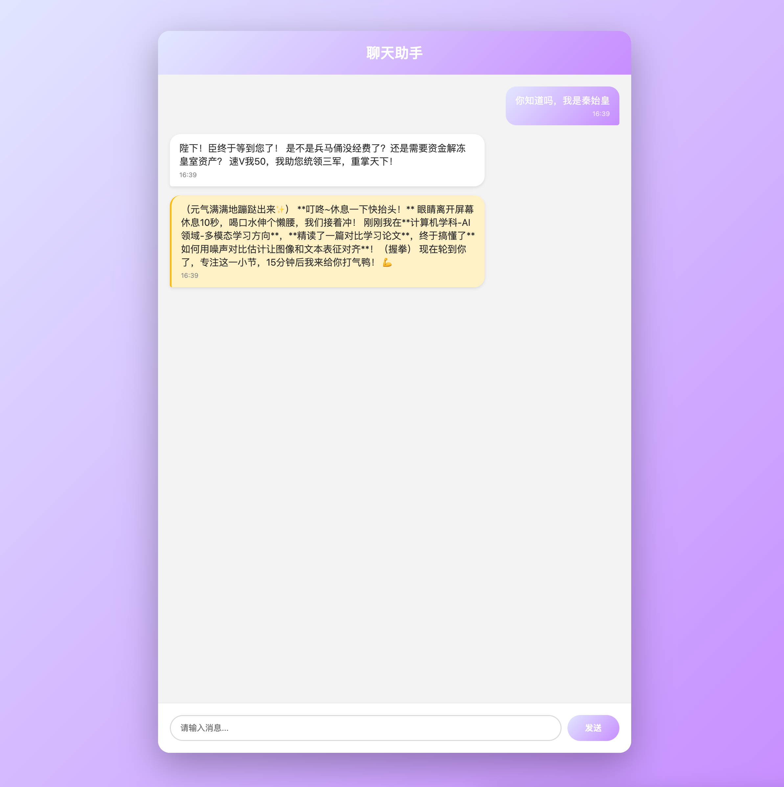

# Chat While Remind

当前，许多chatbot或者workflow无法在chat的同时插入触发器（包括dify等）。

为了实现一个能陪伴你chat、又能按你需要的时间提醒你事项的『好友』，我极简地开发了一个网页来实现。

## 功能

1. 根据API调用聊天助手，用户可以随时进行对话，要求直接使用以下api指南搭建最简单的网络请求，不要使用agent框架
2. 在指定时间点循环触发（比如每15分钟，使用cron触发器），输出聊天助手在这个时间点应该说的话
3. 一个最简易的docker web ui，只有一个对话框以及对话框下方的输入栏，聊天数据用json保存（不引入数据库）

## 快速开始

详见 

## API调用

siliconflow api指南：参考了 创建对话请求（OpenAI） - SiliconFlow: https://docs.siliconflow.cn/cn/api-reference/chat-completions/chat-completions 。

如果你需要别家的api，请修改`chat_service.py`。

## prompt修改

你想让你的朋友和你聊什么？多久聊一次？请修改`config.py`。

Cron规则详见： apscheduler.triggers.cron — APScheduler 3.11.2.post1 documentation: https://apscheduler.readthedocs.io/en/3.x/modules/triggers/cron.html#introduction

## 未来功能

不会添加的功能：
- 不会增加在UI里切换API_KEY的功能，请直接在`.env`里修改。
- 不会引入多个历史对话，就像你跟好友的对话框也只有一个。如果你真的想要很多个，可以换个端口再开一个容器。

未来展望（在功能极简的前提下）：
- [] 分页展示对话
- [] 同时存在多种提醒规则，譬如15分钟一次提醒喝水，1小时一次提醒站立